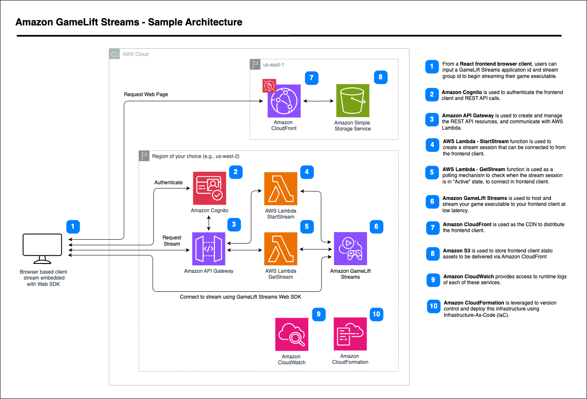

# Welcome to the Amazon GameLift Streams React Starter Sample

The Amazon GameLift Streams React Starter sample repository allows developers to quickly get up and running with [Amazon GameLift Streams](https://aws.amazon.com/gamelift/streams/). Amazon GameLift Streams helps game developers deliver game streaming experiences at up to 1080p resolution and 60 frames-per-second (fps) across devices. Publishers can deploy their game content in minutes, without modifications, onto fully-managed cloud-based GPU instances and deliver them directly to any device with a web browser. Learn more about Amazon GameLift Streams [here](https://aws.amazon.com/gamelift/streams/).

This demo deploys a Single Page Application (SPA) built with [ReactJS](https://react.dev/), an API built with [Amazon API Gateway](https://aws.amazon.com/api-gateway/), [AWS Lambda](https://aws.amazon.com/lambda/) and [Amazon Cognito](https://aws.amazon.com/cognito/) for authorization and authentication to host Amazon GameLift Streams stream sessions behind a login page.
  
## How to Deploy the Demo Application

This project uses the AWS Cloud Development Kit (CDK) to deploy the AWS Infrastructure. You can learn more about CDK [here](https://aws.amazon.com/cdk/). The CDK stacks included deploy the required resources for a fully functioning demo web page, but do not deploy the Amazon GameLift Streams resources themselves. You can add Amazon GameLift Streams application and stream group resources at any time, before or after the deployment of this sample. There is additional information about creating Amazon GameLift Streams resources below in the `Creating a GameLift Stream Application and Stream Group` section.



The Application is deployed through 2 CDK stacks:

1. **AmazonGameLiftStreamsReactStarterAPIStack:** Deploys the serverless API to a region of your choice. This deployment includes:
   1. `StartStream` and `GetStream` Lambda functions
   2. Amazon API Gateway 
   3. Amazon Cognito for authorization and authentication
2. **AmazonGameLiftStreamsReactStarterFrontendStack:** Deploys a single page application (SPA) to `us-east-1`. This deployment includes:
   1. Amazon S3 bucket containing the demo SPA
   2. Amazon CloudFront CDN distribution distributing the SPA
   3. AWS WAF to secure the CloudFront distribution

## Prerequisites
This guide assumes you have the following packages already installed. If not, please install before proceeding.
   * **node** (v18 or above): https://nodejs.org/en/download/ (Optionally: install node and npm with the Node Version Manager (nvm): https://github.com/nvm-sh/nvm)
   * **npm**: https://docs.npmjs.com/downloading-and-installing-node-js-and-npm
   * **aws-cli**: https://docs.aws.amazon.com/cli/latest/userguide/getting-started-install.html
   * **aws-cdk**: https://docs.aws.amazon.com/cdk/v2/guide/cli.html
You can use `aws configure` via aws-cli or other mechanism to authenticate your terminal in order to use CDK. You can find additional information on configuring security credentials [here](https://docs.aws.amazon.com/cdk/v2/guide/configure-access.html). Amazon GameLift Streams is only supported in some AWS regions. It is important to understand the difference between Amazon GameLift Streams `Primary locations` and `Remote locations`. The region where you create your initial Amazon GameLift Streams resources is known as the primary location. Remote locations allow you to extend coverage, enabling you to host your application and stream sessions in additional locations globally. Make sure to set your aws-cli default region to one of the supported Amazon GameLift Streams primary regions. You can find additional information about supported primary regions and remote regions [here](https://docs.aws.amazon.com/gameliftstreams/latest/developerguide/regions-quotas-rande.html).

### Deployment

1. Run `npm run setup` at the root of the repository. This command installs node depedencies, creates a build directory for the frontend production build and creates a gamelift-streams-websdk directory to include the Amazon GameLift Streams Web SDK in the next step.
2. From the Amazon GameLift Streams getting started page (https://aws.amazon.com/gamelift/streams/getting-started/#Resources), download the latest Amazon GameLift Streams Web SDK bundle. For this sample application you do not need the `GameLiftStreamsSampleGamePublisherService` directory within the downloaded Web SDK bundle, only the other Web SDK files. Copy the three gameliftstreams-version.d.ts, .js, and .mjs files as well as the LICENSE.txt file to the `/amazon-gamelift-streams-react-starter-frontend/src/gamelift-streams-websdk` directory.
3. Run `cdk bootstrap` if you have not previously deployed infrastructure using cdk into your AWS account. You can find additional information on this process [here](https://docs.aws.amazon.com/cdk/v2/guide/bootstrapping.html).
4. Run `cdk deploy AmazonGameliftStreamsReactStarterAPIStack` at root level of this repository, to deploy the API and save the resource identifier outputs required for the frontend build.
5. Update the AWS Amplify SDK configuration in the `/amazon-gamelift-streams-react-starter-frontend/src/App.tsx` with the resource identifiers from the previous step. You will need the API endpoint, the Cognito userpool ID and Cognito client ID. **Ensure that the API endpoint has no trailing slash `/` at the end**.
6. Ensure the `gameliftstreamssdk` import path within `/amazon-gamelift-streams-react-starter-frontend/src/StreamComponent.tsx` includes the applicable version of the Web SDK.
7. Add correct region within `amazon-gamelift-streams-react-starter-frontend/src/StreamComponent.tsx` inside the StreamComponent class. This sample uses `us-west-2` by default.
8. Within the `/amazon-gamelift-streams-react-starter-frontend` directory, run `npm run build` to build the single page application frontend. Don't forget that if you make changes to your frontend, you need to re-build with `npm run build` before redeploying the frontend cdk stack.
9. Run `cdk deploy AmazonGameliftStreamsReactStarterFrontendStack` at the root level of this repository, to deploy the web frontend.
10. Once everything is deployed, you can visit your deployed frontend via the Amazon CloudFront distribution, or while developing on localhost by running `npm start` within the `/amazon-gamelift-streams-react-starter-frontend` directory.
11. You will need an Amazon Cognito user to authenticate into the frontend wep page. You will need to manually create this user within the deployed userpool in the Cognito AWS Console. When creating your Cognito user in the AWS console, you can select `Mark email address as verified`, to avoid needing to send yourself a verification code when signing into the web frontend the first time.


### Creating a GameLift Stream Application and Stream Group

Please follow the instructions of the [Amazon GameLift Streams developer documentation](https://docs.aws.amazon.com/gameliftstreams/). Once you have an Amazon GameLift Streams Application and Stream Group set up, you can test your stream directly in the AWS console to make sure that the stream is working. You can then input your application and stream group IDs into the frontend web page of this deployed solution to stream your executable in the browser. You can find additional documentation [here](https://docs.aws.amazon.com/gameliftstreams/), and can follow [this blog post](https://aws.amazon.com/blogs/aws/scale-and-deliver-game-streaming-experiences-with-amazon-gamelift-streams/) for a more in depth overview.

## Pricing and Billing
Amazon GameLift Streams pricing is based on your allocated stream capacity. You are billed for any allocated capacity, whether it's always-on or on-demand capacity. A good practice to help avoid unnecessary charges is to make sure to set both capacity types to 0 when the capacity is not needed. For detailed information about capacity types and pricing, please refer to [Amazon GameLift Streams pricing](https://aws.amazon.com/gamelift/streams/pricing/).

### CloudFront GeoRestriction
Make sure to check CloudFront Geo Restrictions within lib/amazon-gamelift-streams-react-starter-frontend-stack.ts to ensure the frontend is accessible within your desired countries.

## API and Stream Lifecycle

### API Endpoints

1. Start Stream Session
```typescript
POST /
Content-Type: application/json
Authorization: Bearer <cognito-id-token>

Request Body:
{
    AppIdentifier: string;      // Amazon GameLift Streams Application ID
    SGIdentifier: string;       // Amazon GameLift Streams Stream Group ID
    SignalRequest: string;      // WebRTC signal request
    Regions: string[];          // Target regions for stream deployment
}

Response Body:
{
    signalResponse: string;     // WebRTC signal response
    arn: string;                // Stream session ARN
    status: string;             // Session status
}
```

2. Get Stream Session
```typescript
GET /session/{sg}/{arn}
Content-Type: application/json
Authorization: Bearer <cognito-id-token>

Path Parameters:
- sg: Stream Group ID (URL encoded)
- arn: Stream Session ARN (URL encoded)

Response Body:
{
    signalResponse: string;    // WebRTC signal response
    arn: string;              // Stream session ARN
    status: string;           // Session status
}
```

3. Reconnect Stream Session
```typescript
POST /reconnect
Content-Type: application/json
Authorization: Bearer <cognito-id-token>

Request Body:
{
    SessionIdentifier: string;  // Stream session ARN
    SignalRequest: string;      // WebRTC signal request
}

Response Body:
{
    signalResponse: string;     // WebRTC signal response
}
```

### Authentication Flow

1. Users authenticate through Amazon Cognito User Pool
2. Upon successful authentication, an ID token is obtained
3. The ID token is included in API requests via the Authorization header
4. API Gateway validates the token before forwarding requests to Lambda functions

### Stream Session Lifecycle

1. **Initialization**
   - User provides Stream Group ID and Application ID
   - Frontend generates WebRTC signal request

2. **Session Creation**
   - Frontend calls Start Stream API with credentials and configuration
   - Backend initiates stream session with Amazon GameLift Streams
   - Returns session ARN and initial signal response

3. **Session Establishment**
   - Frontend polls Get Stream Session API until status is 'ACTIVE'
   - Maximum polling duration: 600 seconds (10 minutes)
   - Once active, WebRTC connection is established
   - Input controls are attached to the stream

4. **Session Management**
   - Stream can be viewed in windowed or fullscreen mode
   - Input is enabled when entering fullscreen
   - Session can be terminated via the UI
   - Browser disconnection triggers session cleanup

## Multi-Location Stream Groups
This sample application includes a mechanism to use the multi-location stream group feature of Amazon GameLift Streams. You can allocate capacity for multiple regions within a stream group and use the dropdown selector in the web frontend to select which region you would like to stream from. This showcases how to conditionally stream your game executable from differect locations. You can learn more about multi-location stream groups on the [Managing your streams with Amazon GameLift Streams](https://docs.aws.amazon.com/gameliftstreams/latest/developerguide/manage-streams.html) page of the documention and on the [supported locations](https://docs.aws.amazon.com/gameliftstreams/latest/developerguide/regions-quotas-rande.html) page.

## Stream Session Reconnection 
This sample showcases how to reconnect to a previous stream session after losing connection to the stream. This can happen for many reasons. For instances when a user may have accidently closed the browser tab, the internet dropped or other reason for disconnection, the user can quickly reconnect back into the same previous stream session (within a connection timeout) without losing their progress. This uses the [CreateStreamSessionConnection](https://docs.aws.amazon.com/gameliftstreams/latest/apireference/API_CreateStreamSessionConnection.html) action. Within the web frontend, after terminating a stream session, you will see the arn of the previous stream session displayed. This arn can then be used to reconnect back into that previous session.

## Troubleshooting
View logs within the Amazon CloudWatch AWS console. Closely monitor your terminal when deploying CDK stacks and ensure that CDK stacks are properly deployed within the CloudFormation AWS Console. Make sure you are following the deployment steps exactly and in the correct sequence. On mobile devices, when testing your deployed Amazon CloudFront distribution, ensure you include `https://` before the cloudfront url. Desktop browsers often automatically prepend `https://` when needed, but mobile browsers can be more strict and require this.

## Clean Up
You can clean up all the resources you created either with `cdk destroy` or via the CloudFormation AWS Console. If clearing stacks via AWS console, you need to delete the CloudFront distribution (in us-east-1 region) before you can delete the WAF WebACL.

## License
This library is licensed under the MIT-0 License. See the LICENSE file.
